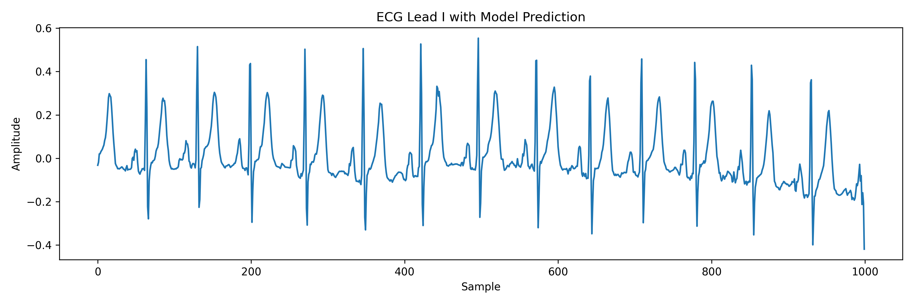
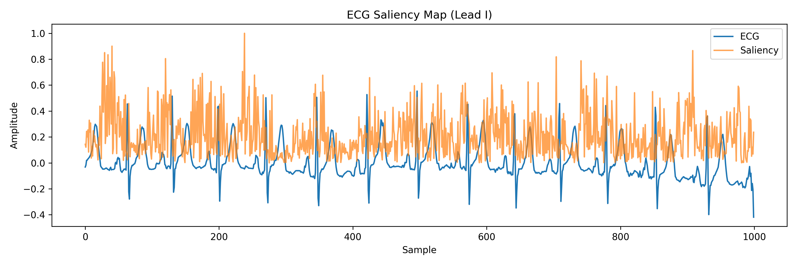

# Deep Learning for ECG-Based Cardiovascular Risk Prediction

Implementation of a deep learning pipeline for cardiovascular abnormality detection from 12-lead ECG signals using the **PTB-XL clinical dataset**.

This repository contains a compact research prototype for deep learning–based ECG classification using the PTB-XL clinical dataset.

This project explores how deep learning models can learn clinically relevant cardiac patterns directly from raw electrocardiogram (ECG) waveforms.

---

## Dataset

**PTB-XL (PhysioNet)**

- 21,799 clinical 12-lead ECG recordings  
- 10-second recordings  
- 100 Hz / 500 Hz waveform versions  
- Expert-annotated diagnostic statements  

For this project, fine-grained SCP diagnostic codes were mapped into five diagnostic superclasses:

- **NORM** — Normal ECG  
- **MI** — Myocardial Infarction  
- **STTC** — ST/T wave changes  
- **CD** — Conduction disturbances  
- **HYP** — Hypertrophy  

---

## Model

A **Residual 1D Convolutional Neural Network** was implemented in PyTorch for multi-label ECG classification.

### Architecture

- Conv1D layers for temporal feature extraction  
- Batch normalization  
- Residual block for improved feature propagation  
- Max pooling  
- Global average pooling  
- Fully connected classifier  

### Input

```
12 leads × 1000 samples
```

### Output

```
5-class multi-label prediction
```

---

## Results

Training was performed on a downloaded PTB-XL subset using the dataset's predefined patient-stratified folds:

- Folds **1–8** — training  
- Fold **9** — validation  
- Fold **10** — test

The dataset split follows the **patient-stratified folds provided with PTB-XL**, ensuring that recordings from the same patient do not appear across training and evaluation sets.

### Test Performance

```text
Macro ROC-AUC ≈ 0.8517
```

### Class-wise ROC-AUC

```
NORM AUC ≈ 0.8682
MI   AUC ≈ 0.7262
STTC AUC ≈ 0.8308
CD   AUC ≈ 0.9000
HYP  AUC ≈ 0.9333
```

These results reflect evaluation on a small downloaded subset of PTB-XL and are intended as a proof-of-concept rather than a full benchmark on the complete dataset.

---

## Example Prediction

Example ECG signal and model prediction:



---

## Model Interpretability

To inspect model behaviour, **gradient-based saliency maps** were used to highlight waveform regions contributing most strongly to predictions.

Example saliency map:



---

## Project Structure

```
src/
    dataset.py              metadata loading and label parsing
    download_records.py     waveform download utility
    ecg_dataset.py          PyTorch dataset for ECG classification
    model.py                residual 1D CNN architecture
    train.py                training pipeline
    evaluate.py             ROC-AUC evaluation
    predict.py              prediction and visualisation
    saliency.py             gradient-based saliency mapping

data/
    raw/                    PTB-XL dataset files

outputs/
    figures/                generated plots and visualisations

models/
    ecg_cnn.pt              trained model weights
```

---

## Quick Start

Clone the repository and install dependencies:

```bash
pip install -r requirements.txt
```

Train a model:

```bash
python -m src.train
```

## Running the Project

### Train the model

```bash
python -m src.train
```

### Evaluate the model

```bash
python -m src.evaluate
```

### Run a prediction example

```bash
python -m src.predict
```

### Generate saliency visualisation

```bash
python -m src.saliency
```

---

## Technologies

- Python  
- PyTorch  
- NumPy / SciPy  
- Pandas  
- Matplotlib  
- WFDB  
- Scikit-learn  
- PhysioNet / PTB-XL  

---

## Motivation

Electrocardiography remains one of the most widely used non-invasive diagnostic tools in cardiovascular medicine.

Machine learning models capable of interpreting ECG waveforms have the potential to:

- support earlier detection of cardiac abnormalities  
- improve automated screening pipelines  
- contribute to clinically useful decision-support systems  

This project was developed as a compact research prototype for **ECG-based cardiovascular risk modelling using deep learning on real clinical waveform data**.

---

## Dataset Reference

Wagner, P. et al. (2020)

**PTB-XL, a large publicly available electrocardiography dataset.**

*Scientific Data.*